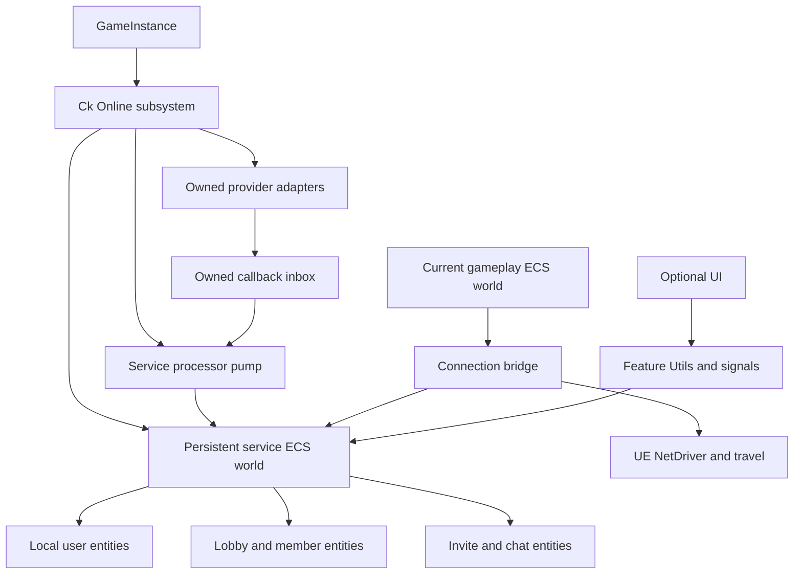

# CkFoundation online services: architecture proposal

Date: 2026-10-02. Status: **research proposal, not an approved implementation plan**.

This document proposes new APIs and modules. Unless explicitly identified as existing, names below are illustrative. Nothing here claims a compiled implementation, a verified Steam build, or working multiplayer. See [the research index](README.md), [the Foundation audit](CK_FOUNDATION_AUDIT.md), [the EIK audit](EIK_SOURCE_AUDIT.md), and [provider research](STEAM_AND_DIRECT_NETWORK_RESEARCH.md) for evidence.

## 1. Recommendation

Build a small **Ck-owned online domain with interchangeable provider adapters**, with Steam and Direct Network as the first profiles. Keep EOS optional for later cross-store services. Remove EIK by replacing the capabilities games actually consume, rather than reproducing its full SDK wrapper surface.

Games compose online features on entities and use `Utils`, deferred requests, queryable state, and signals. They do not subclass an online manager Actor or use provider-specific Blueprint async nodes. A thin GameInstance subsystem owns the persistent ECS service world and the provider resources. UE networking and map travel remain engine integration boundaries.

The initial target is a player-hosted co-op lobby and listen-server game, with a reusable path toward dedicated servers. This is a proposed starting envelope; player count, platform targets beyond Windows, and dedicated-server priority remain product decisions. Do not market unmeasured capacity or latency.

Three separations are essential:

1. **Identity/social:** who the local user is, friends, presence, invitations.
2. **Lobby/control:** membership, readiness, settings, host endpoint, text chat.
3. **Game connection:** authentication/admission, transport, travel, replication readiness.

A lobby can exist without a running Unreal game server. Joining it does not mean the player has connected to gameplay. The provider's lobby owner and the authoritative game host can be different people or processes.

## 2. What removing Actors means here

| Boundary | Proposed result |
|---|---|
| Online user, friends, presence, lobby, member, invite, text channel | ECS entities/fragments; no Actor per object |
| Authentication and asynchronous provider callbacks | Native adapter objects, owned by a GameInstance subsystem; callbacks enqueue owned value payloads |
| Map-independent service processing | Non-Actor service pump driving explicitly selected Ck processors |
| Menus and social UI | Optional widgets consuming Utils/signals; no PlayerController required to authenticate or browse lobbies |
| Gameplay connection and travel | Small UE bridge using NetDriver/world APIs; engine-required PlayerController/GameMode/GameState remain |
| Current Ck gameplay replication and RPC | Retain existing entity replication/ActorRelay infrastructure at its established boundary |
| Current `CkVoiceChat` | Reuse its talker/channel/listener design where applicable; its gameplay transport still uses ActorRelay |

**This proposal removes Actor ownership from the new online domain. It does not replace Unreal replication or make all of CkFoundation Actor-free.** The existing world scheduler is hosted by Actors, and the existing replication path relies on UE actors/components. Replacing those would be a separate architecture project.

EIK itself is primarily OSS interfaces, subsystems, and async UObjects; it is not simply an Actor-based lobby system. The benefit of replacement is Ck composition, controlled lifecycle, provider independence, and a smaller supported surface.

## 3. Proposed module boundaries

Use the existing `CkModuleRules`, Ck logging, descriptor conventions, and conditional AngelScript support. Runtime modules must not depend on editor modules. The feature modules belong with T4 features; reusable hosting mechanics belong in `CkEcs` only if the hosting spike demonstrates a genuinely generic need.

| Proposed module | Owns | Must not own |
|---|---|---|
| `CkOnline` | Service context, provider contracts/capabilities, namespaced IDs, operation correlation/results, persistent service-world host | Concrete Steam/EOS types, lobby/game rules, widgets |
| `CkOnlineIdentity` | Local-user identity, login lifecycle, privileges, account-change handling | Lobby membership or transport selection |
| `CkOnlineSocial` | Friends, presence, invite inbox, normalized join intents | Credentials, gameplay travel, authoritative lobby state |
| `CkLobby` | Search, create/join/leave, member records, metadata, readiness, owner permissions | Authentication UI, raw SDK handles, engine map travel |
| `CkChat` | Text-channel membership, messages, limits, local mute/history, send results | Voice encoding, general RPC bus, arbitrary gameplay payloads |
| `CkOnlineConnection` | Lobby-to-game handoff, endpoint resolution, admission, connect/disconnect/reconnect, travel result | Reimplementation of Ck replication |
| `CkOnlineSteam` | Steam service adapter; narrow SDK extensions where UE OSS lacks required functionality | Provider-neutral business state duplicated in globals |
| `CkOnlineDirect` | Direct lobby/control protocol, endpoint join, optional LAN discovery, reachable-peer bookmarks | Tailscale account management or cloud friends infrastructure |
| `CkOnlineEOS` (later) | EOS Auth/Connect/lobbies/social and supported transport adapter | Mandatory EOS dependency in Steam/Direct builds |
| `CkOnlineUI` (optional) | Ready-made login, lobby browser, members, invites, chat and connection-error UI | Provider logic or authority |
| `CkOnlineEditor` (editor only) | Setup validation, profile generation, packaging diagnostics | Runtime credentials or required gameplay behavior |

These are responsibility boundaries first. A vertical slice can introduce only the modules it needs; do not create empty modules for speculative features. Reusable text chat earns a separate module because lobby and gameplay channels share it. The existing `CkMessaging` is an in-process entity-message feature, not a network chat implementation.

Dependency direction: feature modules depend on `CkOnline` contracts and appropriate Ck primitives; adapters implement the contracts and register factories. `CkOnline` does not statically depend on its implementations. UI depends on feature Utils. `CkOnlineConnection` consumes lobby and identity results; `CkLobby` does not depend back on travel. Provider-specific headers stay private to adapters.

### Optionality must be a build property

Disabling EOS in a settings asset is insufficient if the plugin descriptor or Build.cs still requires its modules or stages its SDK. Prove three build profiles: Direct-only, Steam+Direct, and later Steam+Direct+EOS. Adapter modules may live in Foundation's source tree; optional small provider plugin descriptors may be necessary to express real Unreal build/staging isolation. Decide that after testing UBT dependency behavior, rather than claiming arbitrary modules in one enabled plugin are automatically optional.

The online domain belongs to CkFoundation in either packaging arrangement. Do not fork engine OSS implementations or bundle another EOS SDK copy without a demonstrated gap.

## 4. Persistent service world and ownership

### Existing reference and missing piece

`UCk_GameSession_Subsystem_UE` already owns a private `ck::FEcsWorld` in a `UGameInstanceSubsystem`. Its implementation tracks GameMode post-login/logout and broadcasts player-controller signals; it is not an online lobby/session manager. `FEcsWorld` owns a registry and slot lifetime, but it does not tick processors by itself.

Use that **ownership pattern**, not its actor-facing API, for a new `UCk_Online_Subsystem_UE`. Keep existing `CkGameSession` meaning intact; integrate its UE admission events through the connection bridge when useful. Its module description is broader than the actual source, so it is not evidence that an online state machine already exists.

### Proposed topology

Each GameInstance gets a separate service context and generation. Do not use a process-global mutable current lobby/current user. Shared SDK initialization, if required by a provider, needs explicit reference-counted ownership and per-context routing; it must not collapse PIE instances into one player.

Persistent service entities survive map changes. World entities hold a context reference or transient association resolved through Utils; online identity is never the numeric EnTT entity value. After travel, recreate world-local projections and associate them using provider-qualified account/member IDs. Never copy fragments, entity handles, or save-game blobs from the old registry to pretend they remain live.

### Service pump: an explicit architecture spike

The target is a narrow, non-Actor pump owned by the subsystem, using existing processor registration/order machinery where it can do so safely. `FProcessorGraphBuilder::Build` already accepts an explicit descriptor list and registry; `FProcessorScheduler::Tick` is registry-based. `CkLoadingScreen` supplies a GameInstance + `FTickableGameObject` ownership precedent, but its viewport/dedicated-server restrictions must not be copied. See the precise source references in [the Foundation audit](CK_FOUNDATION_AUDIT.md).

The pump must select only service-compatible processors and required entity-lifetime/signal housekeeping. Global `CK_REGISTER_PROCESSOR` also exposes a processor to gameplay graphs: define service-domain filtering or explicit local descriptor registration so a service processor cannot run twice or in the wrong registry. Do not run the entire world roster against a service registry, or assume timers/state machines work because their types compile.

The existing lifecycle kernel has dependencies on broader gameplay groups, including replication and owning-Actor destruction. Missing graph dependencies can ensure even in permissive mode. A curated graph must supply dependency-complete service ordering or reviewed descriptor rebinding; simply selecting several existing processors is insufficient. `LoadKernel` is snapshot reconstruction scope, not a service-domain selector.

The spike must prove:

- deterministic order and exactly one pump per GameInstance;
- no requirement for a live gameplay world, scheduler Actor, PlayerController, or Actor-backed entity root;
- creation, requests, signals, dirty tracking, EndPlay, destruction and cancellation all work;
- entity debug/registry context and cross-registry references obey existing invariants;
- no accidental replication, transform, physics, save/hydration or render passes;
- valid operation in menus, paused gameplay, world teardown and travel;
- provider event buffering during blocking loads, then bounded draining on resume;
- explicit shutdown even when the ordinary multi-frame world destruction pipeline cannot tick again.

Game-thread blocking loads can still delay processing; GameInstance ownership alone does not guarantee uninterrupted servicing. Online deadlines must use a monotonic clock, represented with `FCk_Time`, rather than world game time or time dilation. Poll/expire on the next permitted service tick; do not promise real-time callbacks during an engine stall.

If existing scheduler construction cannot select a safe subset, propose the smallest reusable CkEcs host/domain filter and review it before implementation. A world-entity facade backed by persistent subsystem state is a lower-infrastructure alternative, but weakens the goal that ECS processors own the online domain; it should be an explicit alternative decision, not a hidden fallback.

## 5. Entity and fragment model

All features use the usual `_Fragment_Data.h`, `_Fragment.h`, `_Processor.h/.cpp`, `_Utils.h/.cpp` quartet. `CkTimer` is the reference for request-drain/re-entrancy/completion mechanics, `CkRecord` for child collections, and `CkGameSession` for registry ownership. Follow current `DEVELOPMENT.md` where older code/skills differ.

| Entity/feature | Representative state | Lifetime |
|---|---|---|
| Online context | Selected profile, adapter availability, service generation, capabilities, diagnostics | GameInstance |
| Online local user | Local player slot, provider accounts, login state, privileges, identity generation | Local user; account change invalidates prior generation |
| Social view | Friends/presence snapshot revision and refresh state | Local user |
| Lobby browser | Query, results, result generation, refresh/expiry | Browser use; results are values or transient result entities |
| Lobby | Provider-qualified lobby ID, membership state, authoritative snapshot revision, permissions | Membership; search result alone is not membership |
| Lobby member | Provider identity, display info, readiness and allowed member metadata | Child of lobby membership |
| Invite | Sender, destination/profile, expiry, acceptance state, origin | Inbox entry until resolved/expired |
| Chat channel | Channel identity, membership, delivery state, bounded message records | Lobby or game channel |
| Game connection | Endpoint descriptor, connecting/admitted state, handshake version, connection generation | One connection attempt or active game connection |

Do not merge these into a giant `OnlinePlayer` fragment. Do not create an Actor for every friend or lobby search result. Use entities for composable independently-lived objects; immutable search rows and chat payloads can remain bounded value arrays when independent composition would add no value.

Representative proposed fragments include `FFragment_OnlineUser`, `FFragment_OnlineUser_Requests`, `FFragment_OnlineUser_PendingOperations`, `FFragment_Lobby`, `FFragment_Lobby_Requests`, `FFragment_Lobby_ProviderInbox`, and `FFragment_ChatChannel_Messages`. Use `_Params` only for retained immutable configuration, `_Tunables` only for mutable configuration, and no catch-all `_Runtime`, `_Status` or `_Tracker` fragments.

Namespaced opaque identifiers distinguish `Steam/account`, `EOS/account`, `EOS/product-user`, `Direct/peer`, and provider lobby IDs. A Steam ID, Epic Account ID and EOS Product User ID are not interchangeable strings. Display names never establish identity. Direct peer IDs are local profile identities unless a stronger verification mechanism is selected.

Record cardinalities explicitly: first release one local user, one active party lobby and one game connection is a reasonable recipe, but shared types must not hardcode user index zero or a global `GameSession` name. Broader split-screen/multiple simultaneous lobby support requires separate acceptance tests before being advertised.

## 6. Provider contract and capability model

Use small contracts for identity, social/invites, lobbies, text channels and connection resolution. Do not expose a universal bag of raw SDK interfaces to games.

Capabilities need more than `IsOnline`:

- supported at build time;
- available in this runtime/profile;
- authorized for this user;
- temporarily unavailable or degraded;
- provider limits and required interaction.

Examples: `NativeFriends`, `NativeLobbyInvites`, `ColdStartInvite`, `LobbySearch`, `InviteOnlyMembership`, `LobbyText`, `GameText`, `LobbyVoice`, `GameplayVoice`, `OwnershipTransfer`, `DedicatedSessionDirectory`. An unsupported feature returns a typed outcome and drives UI availability. A Direct profile must not return a misleading empty Steam friends list.

Profile selection is explicit at boot or through a controlled disconnect-and-reinitialize operation. A profile pairs compatible service and gameplay-transport choices:

| Profile | Identity/social | Lobby/control | Gameplay |
|---|---|---|---|
| Steam native | Steam account/friends/overlay | Steam lobby, metadata, lobby messaging | Tested SteamSockets or selected UE Steam transport |
| Direct | Local profile, optional bookmarks, external share action | Ck host-owned direct lobby/control channel | UE IP networking over reachable IP/DNS, including Tailscale |
| EOS cross-store, later | EOS Connect; EAS when Epic social is needed | EOS lobby + explicit chat transport | EOS-compatible transport or approved shared IP server |

**No silent profile fallback.** A Steam login failure must not quietly create a Direct lobby that Steam friends cannot join. Offer an explicit Direct mode with its known capabilities.

Prefer stock UE OSS Steam behind the adapter for identity, friends, sessions and external UI. Use narrow Steamworks calls for proven gaps such as lobby chat or richer lobby metadata/notifications. Assign a single owner to each operation and cache: do not have OSS and direct Steamworks calls independently create/join/leave the same lobby. A vertical slice must establish which layer owns lobby membership; if a hybrid cannot provide coherent state, use one native Steam lobby adapter rather than fork OSS Steam.

The newer UE Online Services API is a candidate implementation detail, not the public Ck API. Epic's 5.7 documentation labels it Beta; provider completeness must be verified. An enum entry named Steam does not prove a complete Steam provider. See [provider research](STEAM_AND_DIRECT_NETWORK_RESEARCH.md).

## 7. Requests, callbacks and completion

### Public surface

Examples of proposed operations:

| Feature | Operations and observations |
|---|---|
| Online user | `Add`, `Request_Login`, `Request_Logout`, `Get_LoginState`, `Get_Capabilities`, `BindTo_OnLoginStateChanged` |
| Lobby browser | `Request_Search`, `Request_CancelSearch`, `Get_Results`, `BindTo_OnSearchCompleted` |
| Lobby | `Request_Create`, `Request_Join`, `Request_Leave`, `Request_UpdateSettings`, `Request_SetReady`, `Request_KickMember`, `Request_TransferOwnership` |
| Social | `Request_RefreshFriends`, `Request_SendLobbyInvite`, `Request_ShowInviteOverlay`, `Request_AcceptInvite`, `Request_RejectInvite` |
| Chat | `Request_SendText`, `Get_RecentMessages`, `Request_MuteUser`, `BindTo_OnMessageReceived` |
| Connection | `Request_HostGame`, `Request_JoinGame`, `Request_Disconnect`, `Get_ConnectionState` |

These are API sketches, not signatures to paste into game code. Choose exact Utils names, request structs and handle ownership during implementation. Deferred `FCk_Request_Base` requests and in-scope immediate entity `Request_*` mutations follow the trailing generic completion-delegate contract; construction `Add` and subsystem helpers are outside that contract. Richer per-operation result data carries correlation IDs and sanitized provider errors.

### Processing sequence

1. Utils validate the handle/context and request shape, assign/accept a correlation ID, and enqueue a named request with its completion delegate.
2. `HandleRequests` drains a copy and resets the live queue, preserving re-entrant requests for the next pass.
3. Validate capability, current state and permissions before issuing provider work. Put one canonical pending operation in ECS-owned storage before an API that might complete synchronously.
4. Adapter callbacks deep-copy the required data, tag it with context/user/operation generations, and enqueue it. Never capture fragment references, stack storage or borrowed SDK strings into delayed work. Never mutate a registry on a provider thread.
5. A processor drains a bounded inbox on the game thread, validates generations, reconciles provider results into ECS state, and completes the canonical operation once.
6. Commit queryable state/revision and claim the operation's terminal result before any external notification. Remove it from pending ownership, detach its completion carrier into owned dispatch storage, then emit signals/completion. Listeners can safely read the new state; shutdown re-entry cannot complete that operation again. New requests from listeners run on the next pass.

**Do not use the Timer scope-exit guard around merely starting an asynchronous SDK call.** That would report success before login/join succeeds. Retain completion ownership until the requested intent actually holds or fails. `Request_JoinLobby` succeeds when membership is established; `Request_JoinGame` succeeds only at its explicitly defined connection/admission/readiness boundary. Neither means every remote player has finished loading.

The generic completion remains local: it reports the observed result of this process's request. Backend acceptance, server admission and replicated gameplay readiness are different milestones. No generic success callback substitutes for a remote acknowledgment.

### Failure and lifetime rules

- Every operation has a deadline, cancellation behavior, bounded retry policy, and terminal result. Transient network failures, login cancellation, lobby-full, stale invite and unsupported capability are expected results, not programmer assertions.
- Internal invariant violations use `CK_ENSURE_IF_NOT` with total prerequisite checks and recovery in its body. Do not repeat the condition in a following ordinary `if`. Current Shipping flags retain checks; this proposal does not change them or rely on diagnostics for protocol validation.
- External network parsing, authorization and protocol admission are functional requirements with ordinary explicit result-producing control flow. They are not duplicate ensure guards introduced to defeat Shipping policy.
- Correlation is scoped by context generation, account generation, operation ID and, where applicable, lobby/connection epoch. Old-account callbacks cannot log the next user in or resurrect a departed lobby.
- Timeout/cancel does not necessarily cancel the remote effect. A late successful create/join must be reconciled and cleaned up by the adapter; do not discard it and leak remote membership. A retried non-idempotent operation needs deduplication or an explicit query/cleanup strategy.
- Do not retry user-cancelled UI login or accept an old invitation automatically after account switching.
- Serialize conflicting mutations per lobby/user. Search can be superseded with an observable cancellation; create/join/leave need a state machine and rollback.
- Store one canonical completion carrier. Copies of `FCk_Request_Base` have independently copied delegates; unbinding a copy is not a cross-copy exactly-once gate. Existing `TryFireCompletion` executes before unbinding (`CkRequest_Data.cpp:150-151`), so the online operation must already be terminal and absent from pending ownership before it calls that method. Canonical storage alone does not prevent recursive completion.
- Shutdown/profile switching first closes logical admission and invalidates the generation. **Physical destruction of the registry, scheduler and provider waits until active service ticks and callback/signal/completion dispatch have unwound.** Ck signals execute listeners synchronously and access their storage afterward; scheduler ticks also continue after processors return. A listener requesting shutdown cannot free those active stacks. Hold owned dispatch data through the outermost call and perform the bounded final drain at a safe boundary.
- Unregister provider notifications, close ingress, terminalize queued/active requests, leave/disconnect with a bounded shutdown budget, release resources and destroy entities/registry in a defined order. Callback userdata must outlive any callback the SDK can still deliver. A synchronous GI deinitialization needs the same re-entry-safe owner/drain contract, not an assumption that another ordinary frame will arrive.
- ECS fragments observe UObjects weakly. Feature-created objects follow the existing pooled/rooted ownership model; assets use soft references and rooted batches. Do not invent fragment-owned strong GC roots. Native adapters use managed native ownership, with weak callback captures where appropriate.
- Do not expose raw SDK pointers, tokens or network credentials in reflected fragments/signals/save data. Any unavoidable C ABI pointer boundary needs the maintainer's explicit pointer-policy decision before code is written.

## 8. Login and invitation flows

### Steam-first login

Boot configured Steam profile → initialize Steam integration and immediately install owned invite/URL notifications → identify active Steam user → establish required permissions/availability → mark identity ready. Capture launch arguments before UI readiness and buffer all join intents independently of social queries. Query friends/presence and reconcile the invite inbox without delaying notification registration. No Epic account or EOS login is required for a purely Steam-native profile.

A launch invite is captured before menus finish initializing. It waits for the appropriate local user and profile, then follows the same join-intent pipeline as an in-game invite. Steam lobby invites and rich-presence joins are distinct inputs; normalize both without assuming their payloads are the same.

Steam unavailable/offline → typed unavailable state → local UI offers retry or explicit Direct mode. Do not force a browser Epic login to repair Steam availability.

### Direct login

Boot Direct profile → load/create local display profile and peer identity → initialize direct control service → ready. No Steam/Epic account dependency. Tailscale sign-in, device enrollment and policy are external network prerequisites; Ck does not silently install it or manage the user's tailnet.

### Optional EOS login

Game Services need EOS Connect/PUID; Epic friends/presence/overlay need the appropriate Epic Account Services flow. External platform credentials can support Connect without presenting an Epic login for a Game-Services-only design. When EAS is selected, use the documented Auth→Connect sequence and deliberate account linking. Never collapse Epic Account ID and PUID, or silently create a new PUID for an existing player who should link an account. Refresh expiration and handle revocation/account changes. [Epic Connect guide](https://dev.epicgames.com/docs/epic-online-services/eos-fundamentals/connect-interface/connect-guide/log-in-with-an-epic-games-account), [UE EOS plugin](https://dev.epicgames.com/documentation/en-us/unreal-engine/online-subsystem-eos-plugin-in-unreal-engine?application_version=5.7).

### One join-intent state machine

`Captured → WaitingForProfile/User → Resolving → CheckingCompatibility → JoiningLobby → WaitingForGameEndpoint → Connecting → Admitted → Ready`, with explicit cancellation/failure exits at each stage.

An invitation may intentionally end at `JoiningLobby`/membership rather than auto-connect. Game recipe policy determines whether accepting joins the party only or also enters its current game. Respect user consent before leaving an active game/lobby to accept another invite.

Normalize: Steam callback, cold-launch argument, EOS invite, copy/paste join descriptor, and Direct endpoint. Validate game/product, protocol version, provider, address kind, expiry and lobby epoch before use. A join descriptor is structured input, not an arbitrary console command or unrestricted travel URL. Bind map selection to game-authored allowlisted destinations.

## 9. Lobby state and game handoff

Create lobby with product/build/protocol compatibility, capacity, visibility and mode. Treat provider search results as stale hints; revalidate permissions/capacity/version on join and at game admission. Invite-only means enforced admission, not merely hidden search results.

Provider membership is the source of truth for Steam/EOS. The Direct host is the source of truth for Direct membership. Ck state is a revisioned view with reconciliation, not a second uncoordinated authority. Readiness/member settings and host-only configuration have separate write permissions.

Host game transaction:

1. Reserve or initialize a compatible game listener and admission policy.
2. Wait until a usable endpoint is ready; assign a connection epoch.
3. Publish endpoint descriptor and game state atomically or with a versioned ready marker.
4. Clients resolve the endpoint and establish gameplay connections.
5. Server verifies protocol/build/identity and admission, then associates player identities with world entities.
6. Report gameplay ready only after the selected CK replication/construction readiness barrier.

Failure at any required stage closes the partial listener/reservation, withdraws the endpoint, and reports the failed operation. A successful lobby operation must not masquerade as successful server travel.

The endpoint descriptor carries transport kind, address/opaque connect payload, protocol/build ID, lobby ID and connection epoch. It contains no client secret and is not accepted solely because it appeared in lobby metadata.

**Owner migration is not gameplay host migration.** First release should keep a provider lobby alive where supported, but return to a recoverable lobby/rehost flow when the listen server disappears. Seamless game migration requires state capture, authority election, transport reconnection, identity reattachment and conflict resolution; current CkSnapshot capability alone does not establish any of those end-to-end guarantees.

## 10. Direct Network and Tailscale

Implement a small host-owned lobby/control service independent of the Unreal map. A practical first implementation is a bounded, versioned, length-framed reliable connection using an existing UE socket/network facility; exact choice and framing/security need a focused protocol spike. It supports handshake, join/leave, membership snapshots/deltas, readiness, settings, text and game-endpoint handoff. Do not invent custom reliable UDP or a general-purpose backend framework for this slice.

Use a service listener with stable lifetime across map changes. If it shares a port/address with other networking, specify multiplexing and shutdown ownership explicitly; otherwise publish distinct control/game ports. Gameplay remains UE IP networking. A Tailscale route transports those ordinary IP connections; it is not a Ck lobby provider.

First-release discovery:

- same-LAN discovery only where ordinary LAN discovery is supported;
- explicit endpoint/DNS entry, recent hosts and bookmarks;
- copyable join descriptor/link carrying enough information to resolve the host;
- no broad subnet/peer scanning or required Tailscale admin API token.

Tailscale's lack of broadcast/multicast forwarding means a LAN Find Sessions implementation is not a tailnet browser. MagicDNS names can make endpoint entry friendlier, but require the recipient's DNS/network context to resolve them. Share a usable address alternative where appropriate. Reachability also depends on tailnet policy and the host firewall. [Tailscale/Steam source notes](STEAM_AND_DIRECT_NETWORK_RESEARCH.md).

**A short opaque global code needs a rendezvous directory.** Without one, a code must encode the address and invitation data, or refer to a host the recipient already knows. Call that a join link/descriptor, not a universally resolvable six-digit room code.

Direct admission can use an expiring high-entropy invitation capability or host approval, bound to the lobby epoch; display names/IP addresses are not authentication. Choose the trust envelope explicitly. Tailscale encrypts its overlay transport, but does not provide verified Steam identity, application ownership, game bans or chat moderation. If Direct must be safe over untrusted/public Internet paths, select a standard authenticated encrypted channel; do not create custom cryptography or send reusable credentials in plaintext.

Without an always-on service, Direct does not have a global searchable lobby directory, offline invite inbox, universal friends list, or NAT traversal outside the reachable network. Those are separate product/backend scope. A local list of recent peers is not a social identity service.

## 11. Text and voice

Text MVP: UTF-8 lobby and in-game messages; sender identity comes from authenticated membership/connection, not a client-supplied name; bounded length/rate/history; channel membership checks; local mute; visible send failure; message IDs for deduplication. Chat is ephemeral by default, not save-game state. Avoid replaying messages through a last-signal payload as if that were history.

Use Steam lobby messaging for Steam pre-game chat if the selected adapter owns the needed interfaces. Use the Direct control connection for Direct lobby chat. In-game text can use the retained lobby channel or a deliberate gameplay channel; document behavior during disconnection and map loads. Do not use mutable lobby attributes as a text-message log.

EIK has low-level RTC data/P2P building blocks but no complete generic OSS text-chat interface in the supplied source. Future EOS text needs a selected data transport and explicit message semantics; RTC data is not automatically durable, moderated text chat.

Reuse existing `CkVoiceChat` for connected-game talker/channel/listener behavior where its verified transport fits. Its source is independent of OnlineSubsystem, but relies on gameplay world/ActorRelay routing; it is not evidence of pre-game lobby voice. Optional EOS RTC can provide a later provider-backed lobby voice path. Steam voice capture/compression alone is not a complete voice service. Voice-first scope must account for device permissions, mute/volume/PTT, disconnects, moderation/reporting expectations and two-machine audio acceptance.

## 12. Turn-key game recipe

Provide one project profile/settings asset with:

- allowed providers and default selection;
- game/product identifier and protocol compatibility policy;
- Steam App ID for Steam builds;
- host/join map identifiers or game-owned callbacks;
- lobby defaults: capacity, visibility, mode and invite behavior;
- Direct ports/address selection and trust policy;
- optional chat/voice/UI choices;
- later EOS product/sandbox/deployment/client-policy settings.

One reusable online bootstrap recipe composes service context, local user, social/invite view and lobby browser. A game adds its map/mode selection and player spawn policy. The optional Ck UI exposes Host, Find/Join, Invite, Ready, Chat and Leave with state-driven error/retry paths. A custom UI can consume the same Utils. Game-specific mechanics should not require a GameInstance/PlayerController subclass just to use online services.

Editor tooling validates and produces a reviewable config patch/preset. It should explain missing requirements, conflicting NetDriver settings and unused providers. It should not silently overwrite a game's `DefaultEngine.ini` at editor startup.

Defaults reduce repetition, not product identity setup. Ck cannot supply a production Steam App ID, provision Epic portal policy, enroll users into a tailnet or choose which game map should run. Single-build Steam/Direct transport switching is an acceptance gate, not a promise made by a settings enum.

## 13. Alternatives and decisions

| Decision | Recommendation | Strongest counterargument / trigger to change |
|---|---|---|
| Rebuild all EIK wrappers vs task-focused Ck domain | Task-focused identity/lobby/social/chat/connection features | Games may already consume additional EIK services; inventory consumers before removal |
| Native Steam first vs EOS for all builds | Steam native + Direct first | Near-term Steam/EGS shared lobby pools could justify EOS-first common control/transport |
| Persistent service ECS vs world-only facade | Persistent ECS with a small reviewed pump | Scheduler/domain changes may be too intrusive; compare a facade explicitly at the spike |
| Direct social experience | Shareable links and reachable-peer lobbies first | Persistent friends/offline invites require an online identity/directory service |
| First gameplay host loss behavior | Return to lobby/rehost with explicit failure | Games whose core promise requires seamless migration need a separate funded workstream |
| Text/voice | Text first; reuse gameplay voice as a separately gated integration | Voice at launch expands the first acceptance matrix, especially pre-game voice |
| First platform envelope | Validate Windows first; keep portability boundaries | Steam Deck/Linux/macOS requirements must be stated and tested before release claims |

These recommendations await the maintainer's product/architecture decision before implementation. The research task does not authorize removal of the dependency, code changes, builds or publication.
